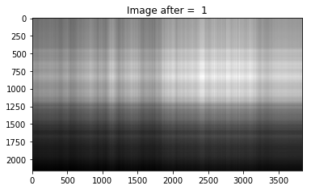
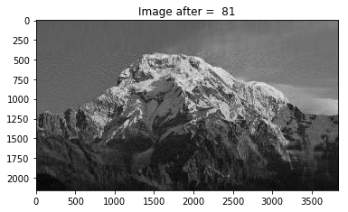

# ImageCompressionUsingSVD

After using just the 1st eigenvalue

After using the first 21 eigenvalues

After using the first 61 eigenvalues

After using the first 81 eigenvalues

##References

First website {https://medium.com/@rameshputalapattu/jupyter-python-image-compression-and-svd-an-interactive-exploration-703c953e44f6}

Info {https://hadrienj.github.io/posts/Deep-Learning-Book-Series-2.8-Singular-Value-Decomposition/}

For PIL {https://pillow.readthedocs.io/en/4.0.x/reference/Image.html}
